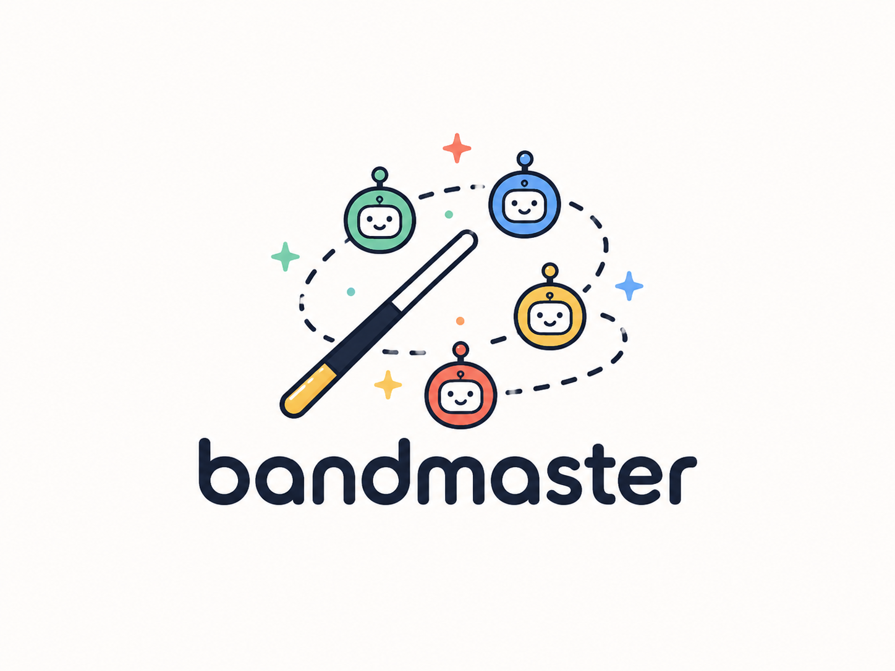

<p align="center">
  
</p>

<h1 align="center">Bandmaster</h1>

<p align="center">
  <strong>Safe, durable coordination for parallel Codex workers in one Git working tree.</strong>
</p>

<p align="center">
  <a href="#built-with-codex-and-gpt-56">Built with Codex</a> ·
  <a href="#why-bandmaster">Why Bandmaster</a> ·
  <a href="#quick-start">Quick start</a> ·
  <a href="#how-it-works">How it works</a> ·
  <a href="#safety-model">Safety model</a> ·
  <a href="#agent-protocol">Agent protocol</a>
</p>

---

Parallel coding agents are fast—until two agents edit the same file, a worker disappears mid-task, or an unreviewed diff lands in Git. **Bandmaster makes shared-working-tree parallelism deliberate.** It gives one parent agent a durable plan, exact file ownership, worker leases, batch barriers, validation, and attributable commits.

Bandmaster is a local Go CLI. It keeps its runtime state under Git metadata, creates no remote branches, and never pushes.

## Built with Codex and GPT-5.6

Bandmaster grew out of using GPT-5.6 in Codex to spawn and manage parallel coding agents. The model proved remarkably capable at breaking work into independent tasks, delegating those tasks, and coordinating workers. The missing piece was a durable orchestration layer: agents still needed a reliable way to declare ownership, communicate progress, preserve context, validate their combined work, and recover safely from interruptions.

Git worktrees can provide isolation, but they are not always practical. A new worktree may be missing local environment variables, compete for development-server ports, duplicate dependencies and other resource-heavy state, and require cleanup afterward. Bandmaster explores a different approach: let agents address multiple issues concurrently on the same branch and in the same working tree, with explicit file claims and Git-aware safety barriers.

Codex was used throughout Bandmaster's development as both the parent orchestrator and the source of specialized worker agents. Bandmaster was also used to improve Bandmaster itself: agents planned changes, claimed files, submitted structured handoffs, ran through batch validation, and produced attributable commits using the tool they were building. That dogfooding loop shaped the CLI, generated skill, recovery model, and agent-facing JSON contract.

## Why Bandmaster

| Without coordination | With Bandmaster |
| --- | --- |
| Agents can silently overwrite one another. | Workers atomically claim exact Git-visible paths before writing. |
| Context disappears when a parent or worker stops. | Tasks, leases, handoffs, snapshots, and audit history persist locally. |
| A passing individual change can break the combined tree. | Frozen batches run focused and repository validation before committing. |
| Commits are hard to attribute or unwind. | One deterministic commit is created per changed task—or the batch rolls back safely. |
| A lost worker might still be editing. | Expired or interrupted work is quarantined until termination is proven or explicitly confirmed. |

## What you get

- **Parallelism without file races** — disjoint, all-or-nothing path claims in a single working tree.
- **A durable orchestration record** — sessions, dependencies, assignment attempts, leases, baselines, handoffs, validation, and audit events survive process restarts.
- **Git integrity protection** — a monitor detects unclaimed edits, submitted-path drift, index/HEAD/branch drift, and unsafe validation mutations.
- **A real commit barrier** — batch membership is frozen, validation is ordered and recorded, then changed tasks are committed in deterministic order.
- **Recovery over guesswork** — failed or interrupted finalization restores the baseline while preserving observed edits; ambiguous state is quarantined.
- **A generated Codex skill** — `bandmaster init` installs project-local instructions for a parent-led, token-based worker protocol.

## Quick start

**Requirements:** Git and a normal clean Git working tree. Go 1.24+ is required only when building from source.

### Install with an LLM

Paste this prompt into a coding agent while it is in the repository you want to coordinate:

```text
Set up Bandmaster safely in the current repository.

1. Confirm the working tree is clean before changing it. If it is not, stop and explain what is dirty.
2. Fetch the latest GitHub Release from `arrudaricardo/bandmaster`, not a source build. Detect the host target: only `darwin/arm64` and `linux/amd64` release binaries are currently supported. Download every `bandmaster_*.tar.gz` archive and `checksums.txt`, verify every archive against the checksums, extract the host archive, and install `bandmaster` to `$HOME/.local/bin/bandmaster`. Add `$HOME/.local/bin` to `PATH` for this session and verify `bandmaster version --json`.
3. Run `bandmaster init --json`, then `bandmaster config status --json` and report the generated paths and exact validation digest.
4. Never run `bandmaster config approve`, never approve `.bandmaster.yaml` on my behalf, and do not start a session. Ask me to review the generated configuration and explicitly run `bandmaster config approve <digest> --json`. Explain that I must commit the generated `.bandmaster.yaml` and `.agents/skills/bandmaster/SKILL.md` before starting a clean session.

Use JSON output for every Bandmaster command and report any unsupported platform, download, checksum, or initialization failure without guessing around it.
```

`init` writes `.bandmaster.yaml` and installs `.agents/skills/bandmaster/SKILL.md`. The configuration is intentionally unapproved at first: review the validation commands before authorizing them. Approval is local to the clone and invalidates whenever the configuration changes.

### Manual setup

```sh
bandmaster init
bandmaster config status
# Review .bandmaster.yaml, then explicitly approve its displayed digest.
bandmaster config approve <digest>
# Commit the generated project files, then start a clean session.
bandmaster session start
```

> **Agent integrations:** append `--json` to every Bandmaster command. Schema-versioned JSON is the stable automation contract.

## How it works

```text
plan → assign → claim → edit → submit → freeze → validate → commit → finish
                    ↑                         │
                    └──── repair / requeue ────┘
```

### 1. Plan independent work

The parent creates durable tasks. Dependencies are released only after prerequisite work succeeds in an earlier batch.

```sh
bandmaster task create \
  --title "Add parser" \
  --intent "Parse quoted fields" \
  --expected-outcome "Quoted input is accepted"

bandmaster task create \
  --title "Document parser" \
  --intent "Explain quoted fields" \
  --expected-outcome "Docs cover the new syntax" \
  --prerequisite <parser-task-id>
```

### 2. Assign and claim exact paths

The parent assigns a ready task and retains the returned assignment token. A worker claims its entire initial write set **before** editing.

```sh
bandmaster task assign <task-id> --worker worker-parser --json
bandmaster task claim <task-id> --token <assignment-token> \
  --path internal/parser.go \
  --path internal/parser_test.go --json
```

Claims are atomic: an overlap blocks the whole attempt rather than granting a partial set. Claims record baselines for regular files, symlinks, absent files, deletions, and executable bits.

### 3. Keep workers accountable

Every token-bearing command renews the worker lease. Long-running workers heartbeat, review their diff, submit a structured handoff, and stop editing.

```sh
bandmaster task heartbeat <task-id> --token <assignment-token> --json
bandmaster task diff <task-id> --token <assignment-token> --json
bandmaster task submit <task-id> --token <assignment-token> \
  --behavior-changed "Parser accepts quoted fields" \
  --key-decisions "Kept streaming tokenization" \
  --validation-expectations "Parser and repository checks pass" \
  --known-risks "None" --json
```

### 4. Freeze, validate, and finalize

Once workers have stopped editing, the parent freezes the collecting batch. Bandmaster validates focused task checks followed by approved repository checks, with authoritative scans around each command.

```sh
bandmaster batch freeze --json
bandmaster batch validate --json
bandmaster batch commit --json
bandmaster session finish --json
```

A successful finalization creates one deterministic local commit per changed task. A no-op task completes without an empty commit. Claims release and dependent tasks become ready only after the complete batch succeeds.

If the finalization process is interrupted, recover it explicitly instead of
reissuing the commit command:

```sh
bandmaster finalization recover --json
# When a recognized transaction reports that rollback needs confirmation:
bandmaster finalization recover \
  --confirmation "Verified the recorded branch, HEAD, index, journal, and hook state" \
  --json
```

The JSON result has stable `batch_id`, `journal_step`, `classification`,
`action`, `outcome`, `idempotent`, `before`, `after`, and `evidence` fields.
Recognized interrupted states can be rolled back while preserving edits and a
clean index. Unknown branch, HEAD, index, journal, monitor, or hook activity is
quarantined. Successful recovery results are auditable and replay unchanged on
repeated invocation.

Automation can branch on the stable errors
`finalization_recovery_required` (use the explicit command),
`finalization_recovery_confirmation_required` (repeat with an inspection
confirmation), and `finalization_recovery_not_found` (no interrupted transaction
or prior recovery exists).

To deliberately stop a recognized nonterminal batch while retaining its edits,
handoffs, snapshots, manifest, ownership, and audit evidence:

```sh
bandmaster batch abandon \
  --reason "The approach was superseded" \
  --confirmation "All worker and finalization processes have stopped" \
  --json
```

Abandonment releases only active claims, cancels the batch's unfinished tasks,
and returns the compatible `paused`/`abandoned` state pair. Inspect the preserved
work or run `session abort` next. If an interrupted finalization journal exists,
the command first invokes explicit finalization recovery; ambiguous Git state
remains quarantined. The stable JSON result and audit record include the reason,
confirmation, before/after states, released claims, Git and journal evidence,
and any finalization recovery. Repeating a successful abandonment replays the
same result without duplicating transitions.

### Diagnose recovery state

`doctor` is a strictly read-only automation surface for deciding which supported
recovery command is safe:

```sh
bandmaster doctor --json
```

A healthy result returns `healthy: true` and an empty `findings` array. Each
finding otherwise has a stable `code`, `severity`, affected session/batch/task
`entities`, `paths`, structured `evidence`, and `supported_actions`. Findings
distinguish `incompatible_session_batch_state`,
`dangling_finalization_journal`, `contradictory_finalization_journal`,
`staged_rollback_residue`, generic `index_drift`,
`unresolved_integrity_violation`, and `database_cleanup_blocker`.

Doctor never repairs state, runs migrations, changes Git, changes monitor state,
or appends audit events. Use only a command listed in the finding's
`supported_actions` after inspecting its evidence.

## Safety model

Bandmaster favors **preserving work and making uncertainty visible** over guessing.

- **No hidden Git mutations:** workers must not add, commit, reset, stash, rebase, checkout, or change branches. Bandmaster owns finalization.
- **Continuous integrity checks:** unowned Git-visible edits, submitted snapshot drift, and Git control-state drift pause the session and quarantine affected work.
- **Validation cannot mutate the tree:** a check that changes Git-visible state is an integrity violation, not a passing validation run.
- **Failed commits preserve edits:** hook, commit, validation, and interruption failures restore the pre-batch branch and index while retaining observed work as uncommitted edits when it is safe to do so.
- **Ambiguity stays quarantined:** a lost worker, uncertain hook, or unknown external Git state is never silently resumed.
- **Abort is non-destructive:** `bandmaster session abort --termination-confirmation "…"` stops orchestration, clears safe claims, and leaves uncommitted Git-visible work in place for inspection.

Ignored untracked paths and external side effects are intentionally outside Bandmaster's rollback guarantee. See [MVP_SPEC.md](MVP_SPEC.md) for the complete contract.

## Agent protocol

Bandmaster's generated skill is designed for a **single parent orchestrator** and multiple workers:

1. Use orchestration only when at least two tasks are independently implementable and testable.
2. The parent alone creates tasks, assigns workers, manages retries, freezes batches, validates, finalizes, and may spawn workers.
3. Workers use JSON commands and assignment tokens; they claim before writing, heartbeat while active, submit a handoff, and then stop.
4. The parent requeues blocked workers, assigns repairs to original owners, and never transfers a claim implicitly.
5. If a session is discovered after a parent interruption, report it and offer to resume—do not silently start replacement workers.
6. Lost worker handles require parent-held termination proof or explicit audited user confirmation before replacement.

The generated instructions live at `.agents/skills/bandmaster/SKILL.md` after initialization.

## Live status dashboard

Run `bandmaster tui` from the project to see the current session, monitor health, integrity alerts, task-state counts, and active task ownership in one terminal view. The dashboard is read-only and refreshes every two seconds; press `r` for an immediate refresh or `q` to exit.

```sh
bandmaster tui
```

## Session operations

```sh
bandmaster session inspect --json
bandmaster session pause --json
bandmaster integrity recover --confirmation "Reviewed and restored the repository" --json
bandmaster session resume --json
bandmaster session abort --termination-confirmation "All worker handles have exited" --json
```

Only one open session is allowed per repository. A new session requires a clean, attached branch and index.

## Automation contract

Every command supports compact `--json` and returns schema version 1. Add `--pretty` alongside `--json` for indented, human-readable JSON; automation should continue to use compact `--json`.

```json
{
  "schema_version": "1",
  "command": "task assign",
  "success": true,
  "result": {}
}
```

On failure, `error.code` and `error.retryable` are stable machine-readable fields. Exit classes are stable too:

| Code | Meaning |
| ---: | --- |
| `0` | Success |
| `1` | Internal failure |
| `2` | Blocked work |
| `3` | Invalid input, state, or unsupported repository |
| `4` | Integrity quarantine |
| `5` | Validation failure |

## Development

```sh
go test ./... -timeout 30m
go build ./cmd/bandmaster
```

CI exercises the CLI integration suite on macOS and Linux, verifies installation through Go, and cross-compiles Darwin ARM64 and Linux AMD64 binaries.

## Releases

Maintainers can create a release from the **Actions → Release** workflow on the default branch. Select a `patch`, `minor`, or `major` bump; the workflow calculates the next strict `vX.Y.Z` tag (starting at `v0.0.1`), runs the full test suite, builds version-stamped Darwin ARM64 and Linux AMD64 archives, writes SHA-256 checksums, pushes the tag, and publishes all assets to a GitHub Release.

## Learn more

- [MVP specification](MVP_SPEC.md) — full product behavior and safety guarantees
- [Generated skill source](internal/project/project.go) — the project-local Codex protocol
- [Integration tests](integration/) — public CLI and Git-visible workflow examples

---

<p align="center">
  <strong>Coordinate boldly. Commit confidently.</strong><br>
  Bandmaster keeps parallel coding work moving without losing the plot—or the work.
</p>
